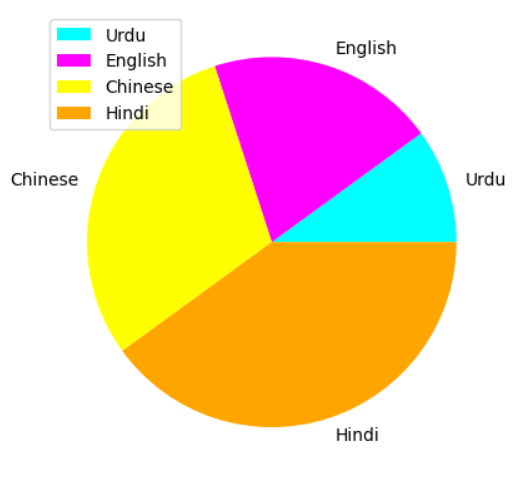
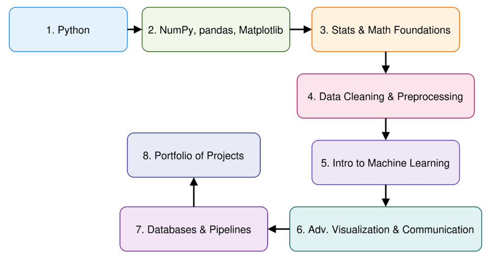

# 🐍 Python Programming — Complete Learning Roadmap

<p align="center">
  
  
  
</p>

<p align="center">
  
</p>

<p align="center">
  <b>🚀 From Python Fundamentals to Data Analysis and Visualization</b>
</p>

---

## 📖 About This Repository

This repository contains a complete collection of **Python programming concepts**, starting from the fundamentals and gradually moving toward **Object-Oriented Programming, Numerical Computing, Data Analysis, and Data Visualization**.

The purpose is to build a strong Python foundation through **concepts, examples, practice, and real-world applications**.

---

# 🗺️ Python Learning Roadmap

```text
🐍 Python
   │
   ├── 👋 Hello World
   │
   ├── 📦 Variables & Data Types
   │
   ├── ➕ Operators
   │
   ├── 🔤 Strings
   │
   ├── 🔀 Control Flow
   │      ├── if / elif / else
   │      └── Loops
   │
   ├── 🧩 Functions
   │      ├── Built-in Functions
   │      └── User-Defined Functions
   │
   ├── 📚 Data Structures
   │      ├── List
   │      ├── Tuple
   │      ├── Set
   │      └── Dictionary
   │
   ├── 🏗️ Object-Oriented Programming
   │      ├── Class
   │      ├── Object
   │      ├── Encapsulation
   │      ├── Inheritance
   │      ├── Polymorphism
   │      └── Abstraction
   │
   └── 📊 Python for Data Science
          ├── NumPy
          ├── Pandas
          └── Matplotlib
```

---

# 🧠 Core Concepts

## 1. 🐍 Python

**Python** is a high-level, interpreted programming language known for its simple syntax and wide range of applications.

Python is commonly used for:

* Web Development
* Automation
* Artificial Intelligence
* Machine Learning
* Data Science
* Data Analysis
* Scientific Computing
* Software Development

### Basic Example

```python
print("Hello, World!")
```

---

# 👋 2. Hello World

The first step in Python programming is learning how to display output.

```python
print("Hello, World!")
```

### Output

```text
Hello, World!
```

The `print()` function displays information on the screen.

<p align="center">
  
</p>

---

# 📦 3. Variables & Data Types

A **variable** is a name used to store a value.

```python
name = "Ali"
age = 21
marks = 87.5
is_student = True
```

### Common Python Data Types

| Data Type | Example           |
| --------- | ----------------- |
| `int`     | `10`              |
| `float`   | `10.5`            |
| `str`     | `"Python"`        |
| `bool`    | `True`            |
| `list`    | `[1, 2, 3]`       |
| `tuple`   | `(1, 2, 3)`       |
| `set`     | `{1, 2, 3}`       |
| `dict`    | `{"name": "Ali"}` |

### Checking Data Type

```python
x = 25

print(type(x))
```

### Output

```text
<class 'int'>
```

---

# ➕ 4. Operators

Operators are symbols used to perform operations on values.

## Arithmetic Operators

```python
a = 10
b = 3

print(a + b)
print(a - b)
print(a * b)
print(a / b)
print(a % b)
print(a ** b)
print(a // b)
```

## Comparison Operators

```python
a = 10
b = 5

print(a > b)
print(a < b)
print(a == b)
print(a != b)
print(a >= b)
print(a <= b)
```

## Logical Operators

```python
x = 10

print(x > 5 and x < 20)
print(x > 15 or x == 10)
print(not(x > 5))
```

---

# 🔤 5. Strings

A **string** is a sequence of characters enclosed in quotes.

```python
name = "Python"

print(name)
```

## String Indexing

```python
text = "Python"

print(text[0])
print(text[1])
```

### Output

```text
P
y
```

## String Slicing

```python
text = "Python"

print(text[0:3])
```

### Output

```text
Pyt
```

## Useful String Methods

```python
text = "hello python"

print(text.upper())
print(text.lower())
print(text.title())
print(text.replace("python", "world"))
```

---

# 🔀 6. Control Flow Statements

Control flow determines **which statements execute and when**.

## If Statement

```python
age = 18

if age >= 18:
    print("Adult")
```

## If / Else

```python
age = 15

if age >= 18:
    print("Adult")
else:
    print("Minor")
```

## If / Elif / Else

```python
marks = 85

if marks >= 90:
    print("A+")
elif marks >= 80:
    print("A")
else:
    print("Needs Improvement")
```

<p align="center">
  
</p>

---

# 🔁 7. Loops

Loops are used to **repeat a block of code**.

## For Loop

```python
for i in range(5):
    print(i)
```

### Output

```text
0
1
2
3
4
```

## While Loop

```python
i = 1

while i <= 5:
    print(i)
    i += 1
```

## Loop Control Statements

### `break`

Stops the loop.

```python
for i in range(10):
    if i == 5:
        break

    print(i)
```

### `continue`

Skips the current iteration.

```python
for i in range(5):
    if i == 2:
        continue

    print(i)
```

---

# 🧩 8. Functions

A **function** is a reusable block of code designed to perform a specific task.

---

## 🔧 Built-in Functions

Python provides many functions that are already available.

```python
print("Hello")
len("Python")
type(10)
max(10, 20, 30)
min(10, 20, 30)
sum([1, 2, 3])
```

Common built-in functions include:

* `print()`
* `len()`
* `type()`
* `input()`
* `range()`
* `sum()`
* `max()`
* `min()`
* `abs()`
* `round()`

---

## 👨‍💻 User-Defined Functions

A user-defined function is created using the `def` keyword.

```python
def greet():
    print("Hello, Python!")

greet()
```

### Function with Parameters

```python
def add(a, b):
    return a + b

result = add(10, 20)

print(result)
```

### Output

```text
30
```

---

# 📚 9. Python Data Structures

Python provides several built-in data structures for organizing collections of data.

```text
List       → Ordered + Mutable
Tuple      → Ordered + Immutable
Set        → Unordered + Unique
Dictionary → Key-Value Pairs
```

---

# 📋 10. List

A **list** stores multiple items in a single variable.

```python
fruits = ["Apple", "Banana", "Mango"]

print(fruits)
```

## Accessing Items

```python
print(fruits[0])
```

## Adding Items

```python
fruits.append("Orange")
```

## Removing Items

```python
fruits.remove("Banana")
```

## List Slicing

```python
print(fruits[0:2])
```

Lists are **mutable**, meaning their contents can be changed.

---

# 📦 11. Tuple

A **tuple** is an ordered collection that cannot be changed after creation.

```python
numbers = (10, 20, 30, 40)

print(numbers)
```

### Accessing Items

```python
print(numbers[0])
```

### Important

```text
List  → Mutable
Tuple → Immutable
```

Tuples are useful when data should remain unchanged.

---

# 🔵 12. Set

A **set** is an unordered collection of unique elements.

```python
numbers = {1, 2, 3, 3, 4}

print(numbers)
```

Duplicate values are automatically removed.

### Adding an Item

```python
numbers.add(5)
```

### Removing an Item

```python
numbers.remove(2)
```

Sets are useful when working with **unique values**.

---

# 📖 13. Dictionary

A **dictionary** stores information in **key-value pairs**.

```python
student = {
    "name": "Ali",
    "age": 21,
    "department": "BSCS"
}
```

### Accessing Values

```python
print(student["name"])
```

### Adding Data

```python
student["semester"] = 6
```

### Updating Data

```python
student["age"] = 22
```

### Looping Through a Dictionary

```python
for key, value in student.items():
    print(key, value)
```

<p align="center">
  <i>🔑 Key + Value → Organized Data → Fast Access</i>
</p>

---

# 🏗️ 14. Object-Oriented Programming

**Object-Oriented Programming (OOP)** is a programming approach based on **classes and objects**.

```text
Class
  ↓
Object
  ↓
Attributes + Methods
```

## Class

A class is a blueprint for creating objects.

```python
class Student:
    pass
```

## Object

An object is an instance of a class.

```python
student1 = Student()
```

---

## `__init__()` Method

The `__init__()` method is commonly used to initialize object attributes.

```python
class Student:

    def __init__(self, name, age):
        self.name = name
        self.age = age

student1 = Student("Ali", 21)

print(student1.name)
print(student1.age)
```

---

## `self`

`self` refers to the current object.

```python
class Student:

    def __init__(self, name):
        self.name = name
```

---

# 🧱 Four Main OOP Concepts

## 🔒 Encapsulation

Combining data and methods inside a class and controlling how they are accessed.

## 🧬 Inheritance

A class can inherit properties and methods from another class.

```python
class Animal:
    def speak(self):
        print("Animal sound")


class Dog(Animal):
    pass

dog = Dog()
dog.speak()
```

## 🔄 Polymorphism

Different objects can provide different implementations of the same operation or method.

## 🎭 Abstraction

<p align="center">
  
</p>

<p align="center">
  <i>🎭 Abstraction in Python → Abstract Class → Subclasses → Specific Implementations</i>
</p>

---

# 🔢 15. NumPy

**NumPy** is a Python library designed for numerical computing and working with arrays.

```python
import numpy as np

arr = np.array([1, 2, 3, 4, 5])

print(arr)
```

## Array Dimensions

```python
arr = np.array([[1, 2, 3],
                [4, 5, 6]])

print(arr.ndim)
```

## Shape

```python
print(arr.shape)
```

## Indexing

```python
print(arr[0, 1])
```

## Slicing

```python
print(arr[:, 1:])
```

## Joining

```python
np.concatenate((arr1, arr2))
```

## Splitting

```python
np.array_split(arr, 3)
```

## Unique Values

```python
np.unique(arr)
```

## Delete

```python
np.delete(arr, 1)
```

NumPy provides the foundation for efficient numerical and array-based operations.

---

# 🐼 16. Pandas

**Pandas** is a Python library used for **data manipulation and data analysis**.

```python
import pandas as pd
```

## DataFrame

A DataFrame is a two-dimensional structure containing rows and columns.

```python
data = {
    "Name": ["Ali", "Ahmed", "Sara"],
    "Age": [21, 22, 20]
}

df = pd.DataFrame(data)

print(df)
```

## Series

A Series is a one-dimensional Pandas data structure.

```python
ages = pd.Series([21, 22, 20])

print(ages)
```

## Reading CSV

```python
df = pd.read_csv("data.csv")
```

## Inspecting Data

```python
df.head()
df.tail()
df.describe()
df.dtypes
```

## Selecting Columns

```python
df["Name"]
```

## Adding a Column

```python
df["Country"] = "Pakistan"
```

## Dropping a Column

```python
df.drop("Age", axis=1)
```

## Handling Missing Values

```python
df.dropna()
```

<p align="center">
  
</p>

<p align="center">
  <i>🐼 Pandas → DataFrame → Data Cleaning → Data Analysis</i>
</p>

---

# 📈 17. Matplotlib

**Matplotlib** is a Python library used for **data visualization**.

```python
import matplotlib.pyplot as plt
```

## Line Plot

```python
x = [1, 2, 3, 4, 5]
y = [10, 20, 15, 30, 25]

plt.plot(x, y)

plt.xlabel("X")
plt.ylabel("Y")
plt.title("Line Plot")

plt.show()
```
<p align="center">
  
</p>

## Bar Chart

```python
names = ["Ali", "Ahmed", "Sara"]
marks = [85, 90, 88]

plt.bar(names, marks)

plt.title("Student Marks")
plt.show()
```
<p align="center">
  
</p>

## Scatter Plot

```python
x = [1, 2, 3, 4, 5]
y = [2, 4, 5, 8, 10]

plt.scatter(x, y)

plt.title("Scatter Plot")
plt.show()
```
<p align="center">
  
</p>

## Histogram

```python
data = [10, 20, 20, 30, 30, 30, 40, 50]

plt.hist(data)

plt.title("Histogram")
plt.show()
```
<p align="center">
  
</p>

## Pie Chart

```python
x = [10,20,30,40]
y = {"English","Urdu","Hindi","Chinese"}
c = {"yellow","magenta", "aqua","orange"}
plt.pie(x, labels=y, colors = c)
plt.legend()
plt.show()
```
<p align="center">
  
</p> 

<p align="center">
  <i>🥧 Pie Chart using Python Matplotlib</i>
</p> 

---

# 🔗 Python Data Science Workflow
<p align="center">
   
</p> 
```text
                 🐍 Python
                    │
          ┌─────────┴─────────┐
          │                   │
      Programming          Data Science
          │                   │
   Variables & Types          │
   Operators                  │
   Conditions                NumPy
   Loops                      ↓
   Functions               Pandas
   Data Structures            ↓
   OOP                    Matplotlib
                              │
                              ↓
                       📊 Data Insights
```

---

# 📚 Topic Summary

| #  | Topic                  | Main Focus               |
| -- | ---------------------- | ------------------------ |
| 1  | Python                 | Programming Language     |
| 2  | Hello World            | Basic Output             |
| 3  | Variables & Data Types | Storing Data             |
| 4  | Operators              | Performing Operations    |
| 5  | Strings                | Text Processing          |
| 6  | Control Flow           | Decision Making          |
| 7  | Loops                  | Repetition               |
| 8  | Functions              | Code Reusability         |
| 9  | Lists                  | Mutable Collections      |
| 10 | Tuples                 | Immutable Collections    |
| 11 | Sets                   | Unique Values            |
| 12 | Dictionaries           | Key-Value Data           |
| 13 | OOP                    | Object-Based Programming |
| 14 | NumPy                  | Numerical Computing      |
| 15 | Pandas                 | Data Analysis            |
| 16 | Matplotlib             | Data Visualization       |

---

# 🛠️ Technologies & Libraries

<p align="center">


</p>

---

# 🎯 Learning Outcomes

After completing these topics, you should be able to:

* Write basic Python programs
* Work with variables and different data types
* Use operators effectively
* Process and manipulate strings
* Make decisions using control flow
* Repeat tasks using loops
* Create reusable functions
* Work with Lists, Tuples, Sets and Dictionaries
* Understand Object-Oriented Programming
* Create classes and objects
* Understand encapsulation, inheritance, polymorphism and abstraction
* Work with NumPy arrays
* Analyze structured data using Pandas
* Create visualizations using Matplotlib
* Build a foundation for **Data Science, AI and Machine Learning**

---

# 🚀 From Beginner to Data Science

```text
🐍 Learn Python
      ↓
🧠 Understand Programming Logic
      ↓
📚 Master Data Structures
      ↓
🏗️ Learn OOP
      ↓
🔢 Learn NumPy
      ↓
🐼 Learn Pandas
      ↓
📊 Learn Matplotlib
      ↓
🤖 Ready for AI / ML / Data Science
```

---

<p align="center">
  <b>🐍 Learn Python. Build Logic. Analyze Data. Create Something Amazing. 🚀</b>
</p>

<p align="center">
  <i>“The best way to learn programming is to write programs.”</i>
</p>
